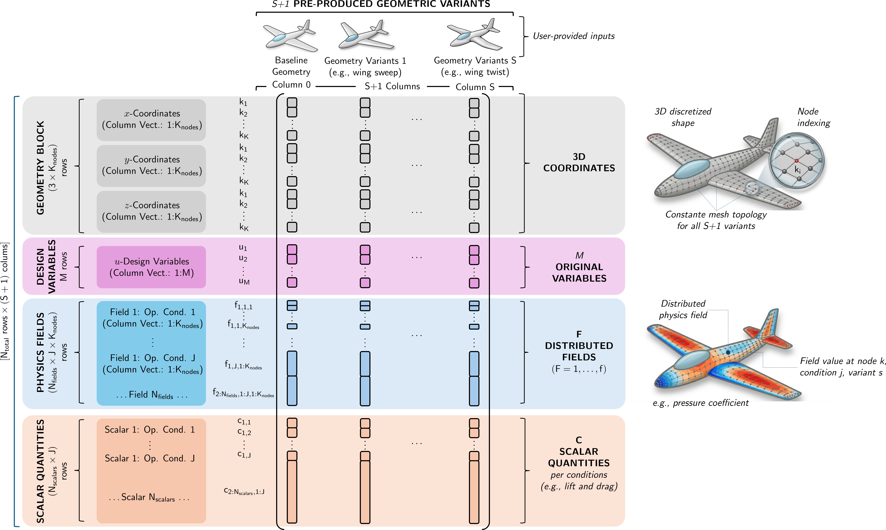

# Input data structure

PME-toolkit operates on datasets describing the variability of parametric geometries.

## Data components

A dataset typically includes:

- geometric data
- design variables
- optional physical quantities (PI-PME / PD-PME)

---

## Global data matrix

PME-toolkit represents all information through a **block-structured data matrix**, where each column corresponds to one design realization.

**Figure:** Structure of the PME data matrix. Geometry, design variables, optional distributed fields, and scalar quantities are stacked into a single matrix. This unified representation enables dimensionality reduction while preserving the link to the original parametric variables.

---

## Geometry representation

Geometry is represented as a matrix:

$$
D \in \mathbb{R}^{n_{\text{features}} \times n_{\text{samples}}}
$$

Where:

- n_samples = number of design realizations
- n_features = number of geometric degrees of freedom

Typical cases:

- 2D geometry → stacked coordinates
- 3D geometry → flattened mesh nodes

Example:

    [x1, x2, ..., xN
     y1, y2, ..., yN
     z1, z2, ..., zN]

---

## Design variables

Design variables are stored as:

$$
U \in \mathbb{R}^{n_{\text{variables}} \times n_{\text{samples}}}
$$

These correspond to the original parametric model and are explicitly included in the data matrix, enabling **analytical backmapping** from the reduced space.

---

## PME embedding matrix

PME internally constructs:

$$
\mathbf{P} =
\begin{bmatrix}
\mathbf{D} \\
\mathbf{U}
\end{bmatrix}
$$

This is the matrix used for dimensionality reduction.

---

## Optional physical data

For PI-PME / PD-PME, additional matrices may be included:

- pressure fields
- performance indicators

These are appended as additional rows in P, extending the embedding with physical information.

---

## Key requirement

All data must be:

- aligned sample-wise
- consistent in dimension
- free of missing values (after filtering)

---

## Summary

The entire PME workflow relies on a **consistent data matrix representation**, where each column represents one design realization and multiple data sources are combined into a unified embedding space.
