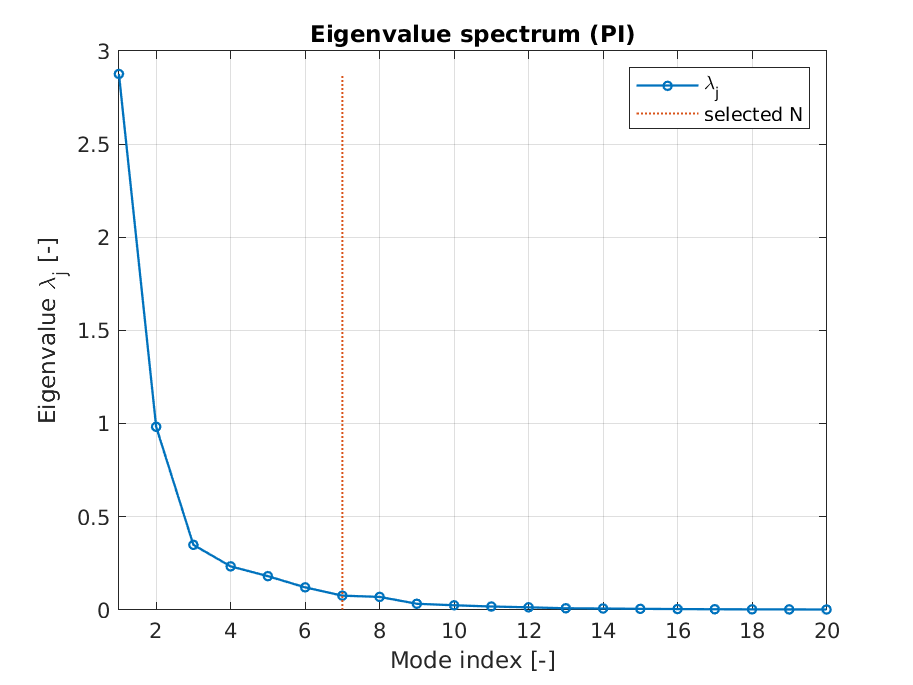
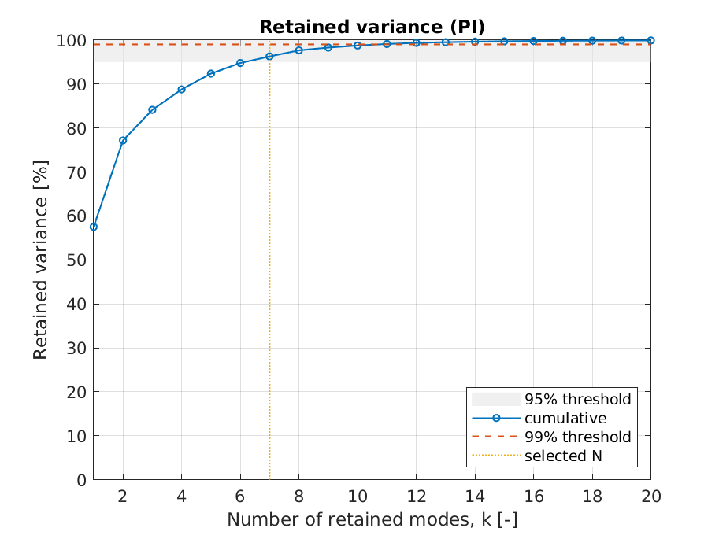
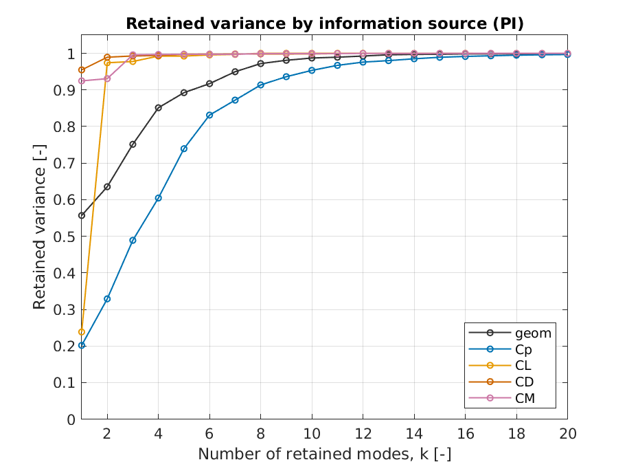
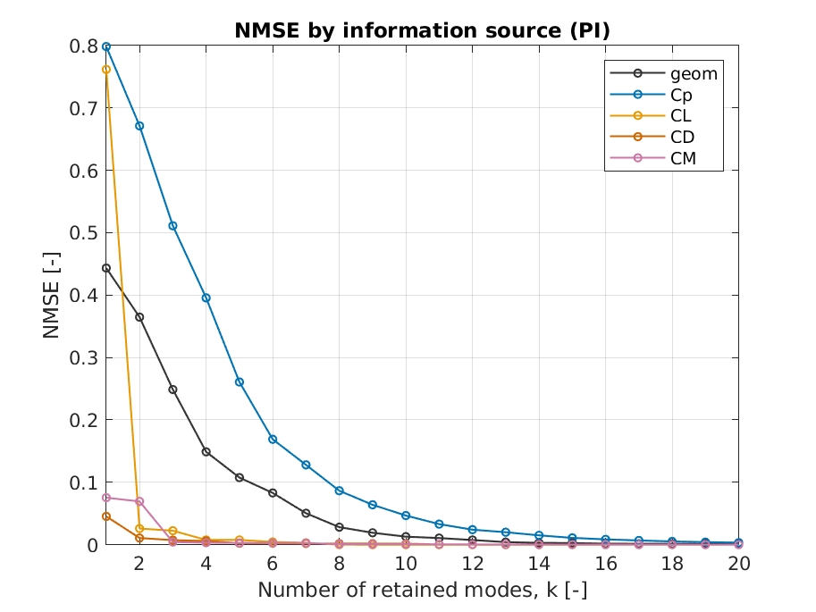
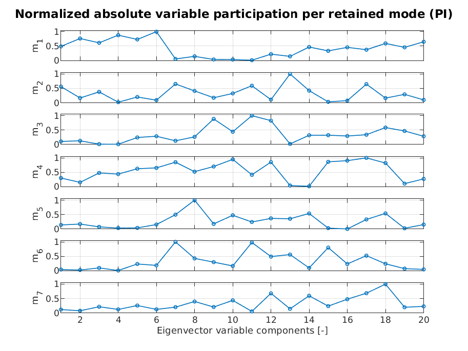
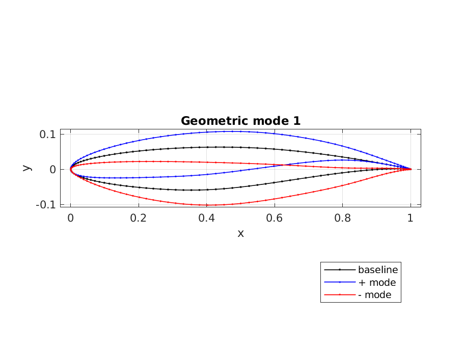
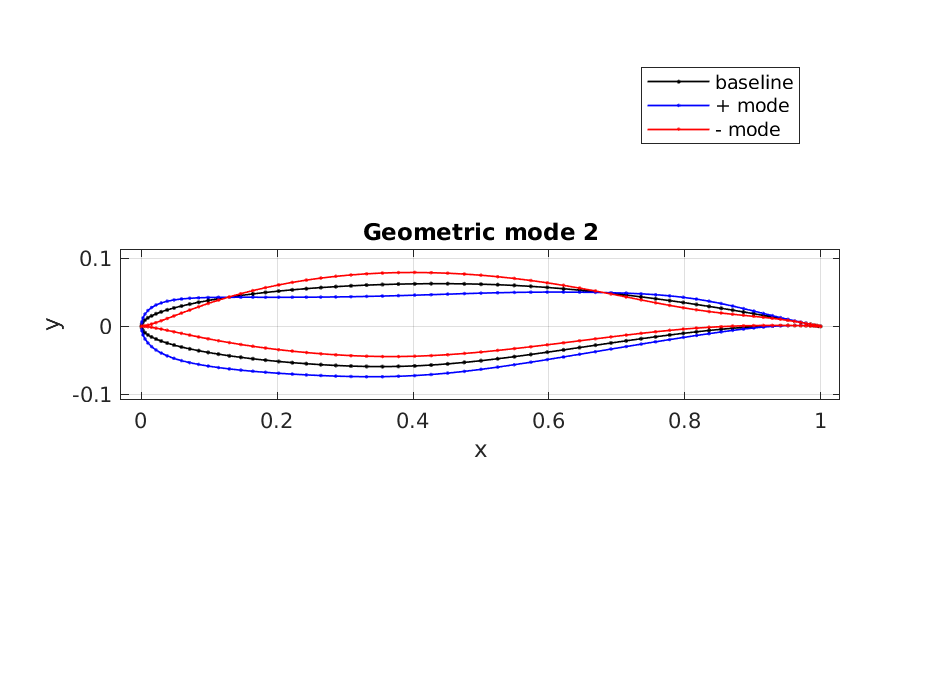
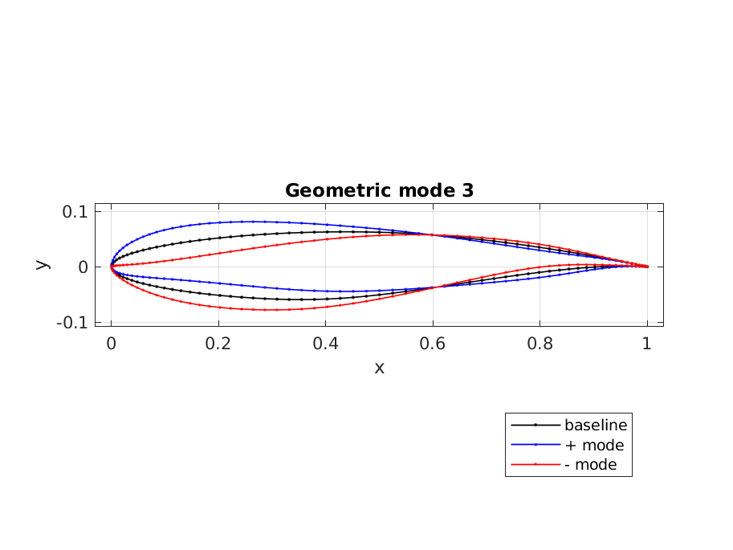

# Visualization

PME-toolkit automatically generates visualization figures during the benchmark workflow.

These figures help interpret the dimensionality reduction results produced by PME, PI-PME, and PD-PME and evaluate the quality of the reduced representation.

The figures shown in this page are example outputs generated from the glider benchmark dataset.

All plots are automatically produced during the execution of a benchmark case and stored in the `results/` directory.

---

## Visualization workflow

Visualization figures are generated automatically when running a benchmark case.

After execution, the `results/` directory contains the generated outputs including figures and report data.

A typical results directory contains files such as:

```
results/
- report.mat
- scree_plot.png
- variance_retained.png
- variance_by_source.png
- nmse_by_source.png
- variable_modes_normalized.png
- mode_1.png
- mode_2.png
- mode_3.png
```

The exact files may vary depending on the benchmark configuration and workflow.

---

## Eigenvalue spectrum (Scree plot)

The scree plot shows the eigenvalue spectrum associated with the embedding.



A rapid decay of the eigenvalues indicates that most of the relevant variability of the design space can be captured using a small number of retained modes.

This plot is useful to assess:

- intrinsic dimensionality of the design space
- relative importance of successive modes
- potential truncation levels for the reduced representation

---

## Retained variance

The cumulative retained variance indicates how much of the total variance of the embedding is captured by the retained modes.



Typical thresholds used in dimensionality reduction include:

- 95% retained variance
- 99% retained variance

The selected dimensionality corresponds to the smallest number of modes that satisfies the chosen threshold.

---

## Retained variance by information source

When multiple information sources are included in the embedding (for example geometry and physical quantities), it is useful to analyze how the retained variance is distributed across them.



This plot helps understand:

- whether the embedding is mainly driven by geometry
- whether physical observables contribute significantly
- how balanced the reduced representation is across heterogeneous sources

This analysis is particularly relevant for PI-PME and PD-PME workflows.

---

## Reconstruction error by information source

The normalized mean squared reconstruction error (NMSE) can also be analyzed separately for each information source.



This plot indicates how accurately the reduced representation reconstructs each component of the dataset.

Lower NMSE values indicate better reconstruction accuracy.

This visualization is useful to compare reconstruction quality across heterogeneous data sources.

---

## Variable participation in retained modes

When design variables are included in the embedding, their contribution to the retained modes can be visualized.



This plot shows the normalized absolute contribution of each design variable to each retained mode.

It helps interpret the reduced coordinates and identify which original variables most strongly influence the latent representation.

---

## Geometric modes

The geometric interpretation of the reduced coordinates can be visualized through modal perturbations of the baseline geometry.

### Mode 1



### Mode 2



### Mode 3



In these figures:

- the black curve represents the baseline configuration
- the blue curve represents the positive perturbation along the mode
- the red curve represents the negative perturbation

These visualizations provide an intuitive interpretation of how each reduced coordinate modifies the original geometry.

---

## Interpreting the visualizations

The different plots should be interpreted together to obtain a complete understanding of the reduction quality.

Important considerations include:

- eigenvalue decay indicates intrinsic dimensionality
- retained variance quantifies global information preservation
- source-wise variance highlights the contribution of heterogeneous data
- NMSE measures reconstruction accuracy
- variable participation supports interpretability
- geometric modes reveal deformation patterns associated with the reduced coordinates

Together, these visualizations support both quantitative evaluation and qualitative interpretation of the reduced design space.

---

## Notes

The exact appearance and number of generated figures depend on the selected benchmark configuration and the information sources included in the embedding.

Visualization is handled internally by the MATLAB workflow and is automatically executed during the benchmark run.

For benchmark setup and execution, see the documentation pages on Benchmarks, Datasets, and Reproducibility.
